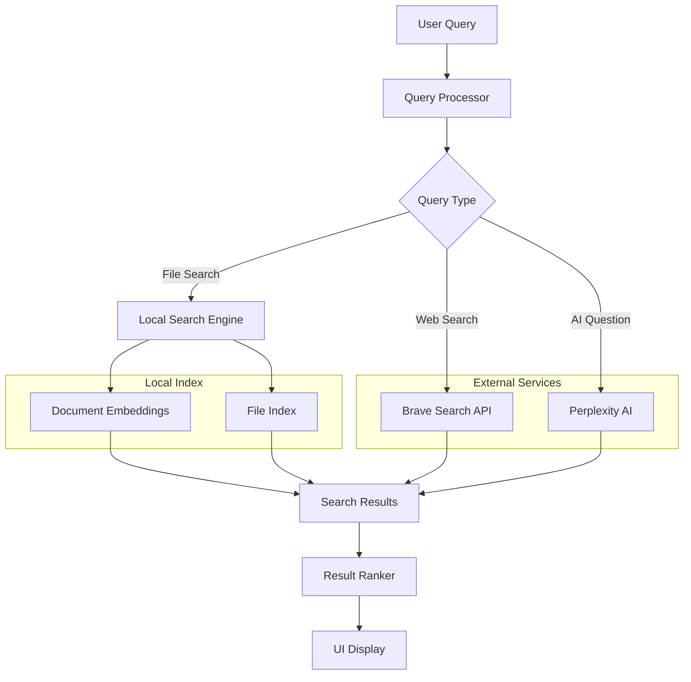
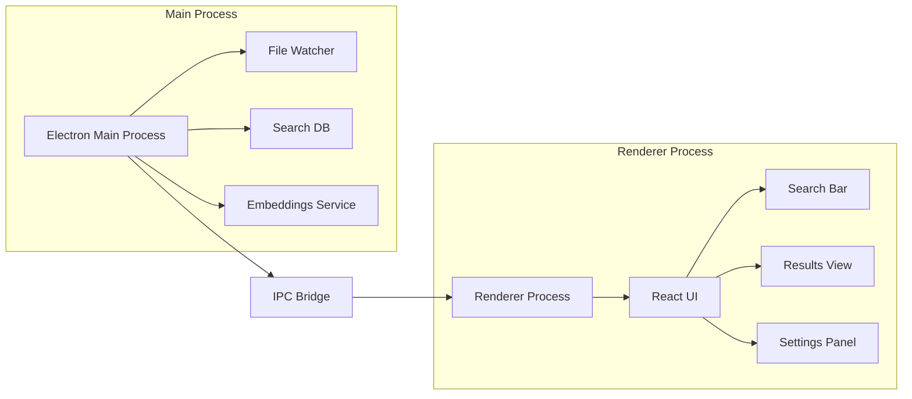
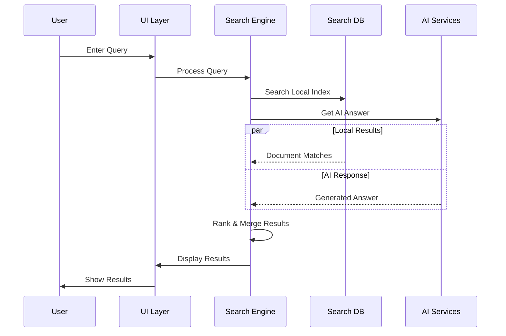
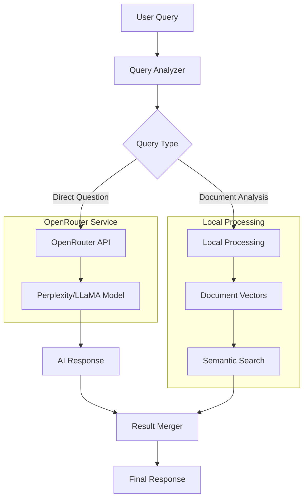
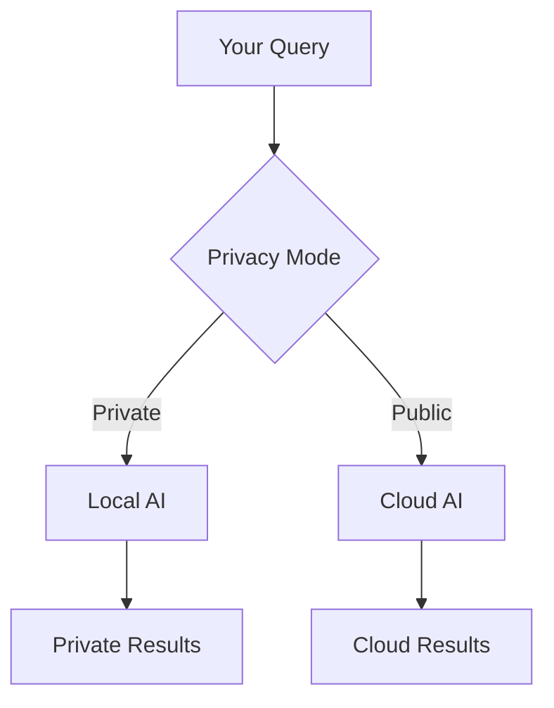
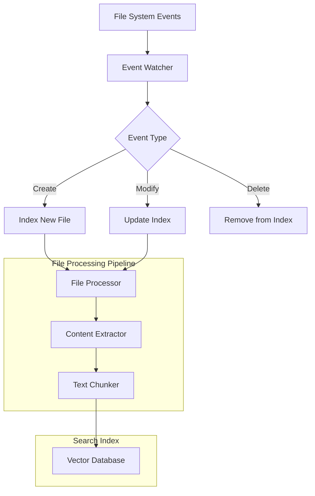
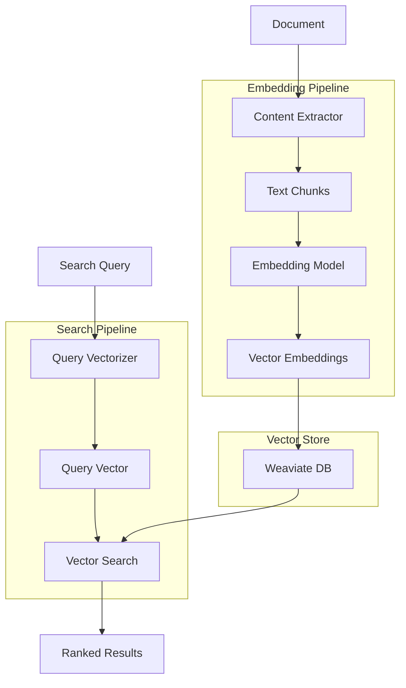
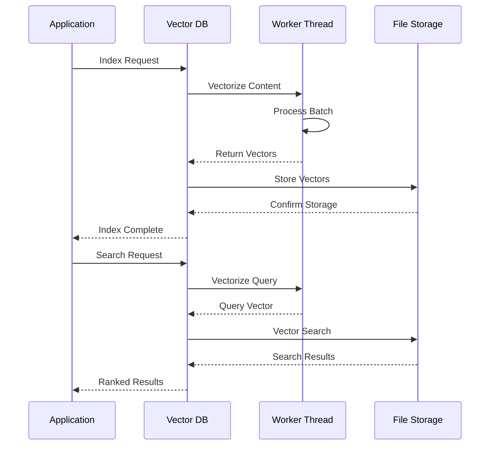

# alBERT-launcher

Your AI-powered file launcher and search assistant. Think Spotlight or Alfred, but with the intelligence to understand what you're looking for.


## Installation

### macOS

1. Download the latest release for your architecture:
   - For Apple Silicon (M1/M2): `albert-launcher-{version}-mac-arm64.dmg`
   - For Intel: `albert-launcher-{version}-mac-x64.dmg`
2. Open the DMG file and drag alBERT to your Applications folder
3. Since the app is not signed with an Apple Developer certificate, you'll need to:
   - Right-click (or Control-click) on alBERT in Applications
   - Select "Open" from the context menu
   - Click "Open" in the security dialog
   - This is only required for the first launch
4. Future launches will work normally using Alt+Space (or your configured shortcut)

### From Source

```bash
# Clone the repository
git clone https://github.com/lekt9/albert-launcher
cd albert-launcher

# Install dependencies
npm install

# Start the app in development mode
npm run dev

# Build the app
npm run build
```

## What Makes alBERT Different?

Unlike traditional file search tools that rely on filename matching or basic content indexing, alBERT-launcher uses advanced semantic search and AI capabilities to understand the meaning behind your queries. It maintains a dedicated folder (`~/alBERT`) where it indexes and searches through your important documents, providing:

- **Semantic Search**: Find documents based on meaning, not just keywords
- **AI-Powered Answers**: Get direct answers to questions about your documents
- **Context-Aware Results**: Results are ranked based on relevance to your query context
- **Instant Access**: Global shortcut (Alt+Space) to access from anywhere

## How It Works



### Architecture Overview



### Search Flow



## Features

- 🚀 Lightning-fast local file search
- 🤖 AI-powered answers using Perplexity
- 🔍 Semantic search capabilities
- 🌐 Web search integration with Brave Search
- ⌨️ Global keyboard shortcuts (Alt+Space)
- 💾 Smart caching system
- 🎯 Context-aware search results
- 📱 Modern, responsive UI

## Core Concepts

### The alBERT Folder
The `~/alBERT` folder is your personal knowledge base. Any files placed here are:
- Automatically indexed for semantic search
- Processed for quick retrieval
- Analyzed for contextual understanding
- Accessible through natural language queries

### Semantic Search
alBERT uses advanced embedding techniques to understand the meaning of your documents:
1. Documents are split into meaningful chunks
2. Each chunk is converted into a high-dimensional vector
3. Queries are matched against these vectors for semantic similarity
4. Results are ranked based on relevance and context

### AI Integration
- **Query Understanding**: Natural language processing to understand user intent
- **Context Awareness**: Maintains conversation context for follow-up queries
- **Smart Answers**: Generates answers by combining local knowledge with AI capabilities

### OpenRouter Integration

alBERT-launcher uses OpenRouter to access powerful language models for enhanced search capabilities:



#### OpenRouter Features
- **Model Selection**: Uses Perplexity's LLaMA-3.1-Sonar-Small-128k model for optimal performance
- **Context Integration**: Combines AI responses with local document context
- **Source Attribution**: AI responses include relevant source URLs
- **Streaming Responses**: Real-time response streaming for better UX
- **Fallback Handling**: Graceful degradation when API is unavailable

Example OpenRouter configuration:
```typescript
const openRouterConfig = {
  model: "perplexity/llama-3.1-sonar-small-128k-online",
  temperature: 0.7,
  maxTokens: 500,
  systemPrompt: "You are a search engine api that provides answers to questions with as many links to sources as possible."
}
```

### Privacy-First: Local AI with Ollama

alBERT-launcher puts your privacy first by supporting local AI processing through Ollama integration. Switch between cloud and local AI with a single click:



#### Features

- 🔒 **Privacy Mode**: Switch between local and cloud AI instantly
- 💻 **Local Processing**: Keep your data on your machine
- 🌐 **Flexible Choice**: Use cloud AI when you need more power
- ⚡ **Fast Response**: No internet latency in local mode
- 💰 **Cost-Free**: No API costs when using local models
- 🔌 **Offline Support**: Work without internet connection

#### Quick Setup

1. Install Ollama from [ollama.ai](https://ollama.ai)
2. Enable "Private Mode" in alBERT settings
3. Start searching with complete privacy!

#### Available Models

Choose from various powerful local models:
- Llama 2
- CodeLlama
- Mistral
- And more from Ollama's model library

#### Why Local AI?

- **Complete Privacy**: Your queries never leave your computer
- **No API Costs**: Use AI features without subscription fees
- **Always Available**: Work offline without interruption
- **Full Control**: Choose and customize your AI models

### File System Integration

alBERT-launcher implements a sophisticated file system monitoring and indexing system:



#### File System Features

1. **Automatic Monitoring**
   - Real-time file change detection
   - Efficient delta updates
   - Handles file moves and renames
   - Supports symbolic links

2. **Content Processing**
   ```typescript
   // Example content processing pipeline
   async function processFile(filePath: string) {
     const content = await readContent(filePath)
     const chunks = splitIntoChunks(content)
     const vectors = await vectorizeChunks(chunks)
     await updateSearchIndex(filePath, vectors)
   }
   ```

3. **Supported File Types**
   - Text files (.txt, .md, .json)
   - Documents (.pdf, .doc, .docx)
   - Code files (.js, .py, .ts, etc.)
   - Configuration files (.yaml, .toml)
   - And more...

4. **Smart Indexing**
   - Incremental updates
   - Content deduplication
   - Metadata extraction
   - File type detection

5. **Search Capabilities**
   - Full-text search
   - Fuzzy matching
   - Regular expressions
   - Metadata filters

#### File Organization

The `~/alBERT` directory structure:
```
~/alBERT/
├── documents/           # General documents
├── notes/              # Quick notes and thoughts
├── code/               # Code snippets and examples
├── configuration/      # Config files and settings
└── .alBERT/           # Internal index and metadata
    ├── index/         # Search indices
    ├── vectors/       # Document vectors
    ├── cache/         # Query cache
    └── metadata/      # File metadata
```

#### Performance Optimizations

1. **Indexing**
   - Batch processing for multiple files
   - Parallel processing when possible
   - Priority queue for important files
   - Delayed processing for large files

2. **Search**
   ```mermaid
   graph LR
       A[Query] --> B[Vector]
       B --> C{Search Type}
       C -->|ANN| D[Approximate Search]
       C -->|KNN| E[Exact Search]
       D --> F[Results]
       E --> F
   ```

3. **File Monitoring**
   - Debounced file system events
   - Coalescence of multiple events
   - Selective monitoring based on file size
   - Resource-aware processing

## Vector Database Implementation

alBERT-launcher uses Weaviate Embedded as its vector database engine, providing efficient storage and retrieval of document embeddings:



#### Vector Database Architecture

1. **Document Processing**
   ```typescript
   interface WeaviateDocument {
     content: string
     path: string
     lastModified: number
     extension: string
   }
   ```

2. **Schema Definition**
   ```typescript
   const schema = {
     class: 'File',
     properties: [
       { name: 'path', dataType: ['string'] },
       { name: 'content', dataType: ['text'] },
       { name: 'filename', dataType: ['string'] },
       { name: 'extension', dataType: ['string'] },
       { name: 'lastModified', dataType: ['number'] },
       { name: 'hash', dataType: ['string'] }
     ],
     vectorizer: 'none'  // Custom vectorization
   }
   ```

#### Embedding System

1. **Worker-based Processing**
   - Dedicated worker threads for vectorization
   - Parallel processing of document batches
   - Automatic resource management
   - Error handling and recovery

2. **Batch Processing**
   ```typescript
   // Example batch processing
   export const embed = async (
     text: string | string[],
     batch_size: number = 15
   ): Promise<number[] | number[][]> => {
     // Process in batches for optimal performance
   }
   ```

3. **Reranking System**
   - Cross-encoder for accurate result ranking
   - Contextual similarity scoring
   - Optional document return with scores

#### Performance Features

1. **Efficient Storage**
   - Incremental updates
   - Document hashing for change detection
   - Optimized vector storage
   - Automatic garbage collection

2. **Fast Retrieval**
   ```mermaid
   graph LR
       A[Query] --> B[Vector]
       B --> C{Search Type}
       C -->|ANN| D[Approximate Search]
       C -->|KNN| E[Exact Search]
       D --> F[Results]
       E --> F
   ```

3. **Optimization Techniques**
   - Approximate Nearest Neighbor (ANN) search
   - Vector quantization
   - Dimension reduction
   - Caching strategies

#### Advanced Features

1. **Hybrid Search**
   - Combined keyword and semantic search
   - Weighted scoring system
   - Metadata filtering
   - Context-aware ranking

2. **Vector Operations**
   ```typescript
   interface RankResult {
     corpus_id: number
     score: number
     text?: string
   }
   ```

3. **Quality Assurance**
   - Automated consistency checks
   - Vector space analysis
   - Performance monitoring
   - Error detection

#### System Integration



## Prerequisites

- Node.js (v16 or higher)
- pnpm package manager
- Brave Search API key (optional)
- OpenRouter API key (optional)

## Development

```bash
# Start the development server
pnpm dev
```

## Building for Production

```bash
# For macOS
pnpm build:mac

# For Windows
pnpm build:win

# For Linux
pnpm build:linux
```

## Configuration

Create a `.env` file in the root directory with the following variables:
```env
BRAVE_API_KEY=your_brave_api_key
OPENROUTER_API_KEY=your_openrouter_api_key
```

## Project Structure

```
alBERT-launcher/
├── src/
│   ├── main/                 # Electron main process
│   │   ├── api.ts           # tRPC API endpoints
│   │   ├── db.ts            # Search database management
│   │   ├── embeddings.ts    # Text embedding functionality
│   │   └── utils/           # Utility functions
│   ├── renderer/            # React frontend
│   │   ├── components/      # UI components
│   │   ├── lib/            # Utility functions
│   │   └── App.tsx         # Main application component
│   └── preload/            # Electron preload scripts
├── public/                 # Static assets
└── electron-builder.json5  # Build configuration
```

## API Documentation

### Search API
The search API supports various query types:
- Basic text search
- Semantic search
- Natural language questions
- File metadata queries

Example queries:
```
"find documents about react hooks"
"what are the key points from my meeting notes?"
"show me python files modified last week"
```

### File Monitoring
alBERT automatically monitors the `~/alBERT` folder for:
- New files
- File modifications
- File deletions
- File moves

Changes are automatically indexed and available for search immediately.

## Contributing

We welcome contributions! Please see our [Contributing Guide](CONTRIBUTING.md) for details.

## License

This project is licensed under the MIT License - see the [LICENSE](LICENSE) file for details.

## Acknowledgments

- [Electron](https://www.electronjs.org/)
- [React](https://reactjs.org/)
- [tRPC](https://trpc.io/)
- [Brave Search](https://brave.com/search/)
- [OpenRouter](https://openrouter.ai/)

## Support

If you encounter any issues or have questions, please file an issue on our [GitHub Issues](https://github.com/lekt9/alBERT-launcher/issues) page.
