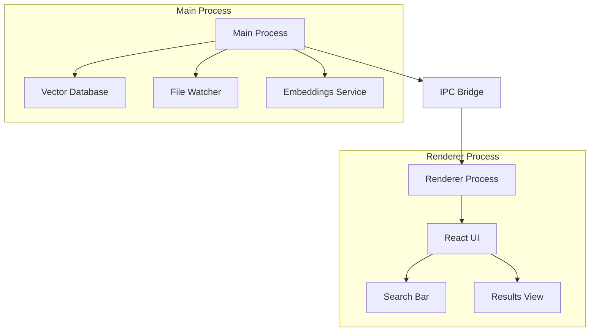
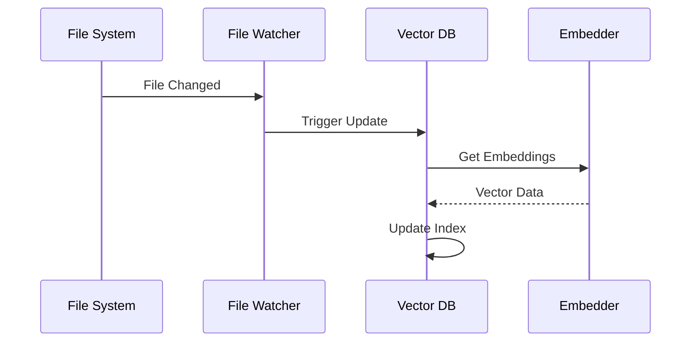
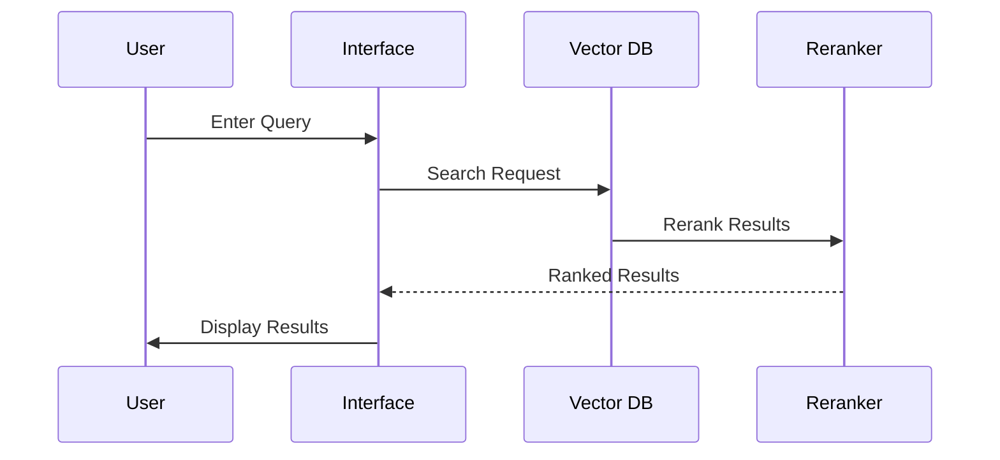

# alBERT-launcher Architecture

## Overview

alBERT-launcher is built on Electron with a modern architecture that emphasizes performance, privacy, and extensibility. The application is divided into three main components:

## Core Components

### 1. Vector Database (src/main/db.ts)

The heart of alBERT's semantic search capabilities is its embedded vector database using Weaviate:

- **Local First**: Runs entirely on your machine
- **Zero Setup**: No external database or infrastructure needed
- **Efficient Storage**: Uses file-based persistence with smart caching
- **Real-time Updates**: File watcher for automatic index updates

Key features:
- Document embedding and indexing
- Semantic search with hybrid retrieval
- Automatic file tracking and updates
- Persistent storage with hash-based change detection

### 2. Embeddings Engine (src/main/embeddings.ts)

Handles all text-to-vector conversions:

- **Worker-based Processing**: Parallel processing for better performance
- **Batched Operations**: Smart batching for efficient processing
- **Local Models**: Uses local transformer models via Ollama
- **Flexible API**: Supports both single and batch operations

### 3. Main Process (src/main/index.ts)

Manages core application functionality:

- Global shortcut registration (Alt+Space)
- Window management
- System tray integration
- IPC communication
- Database initialization
- File system monitoring

### 4. Renderer Process (src/renderer/)

Modern React-based UI with:

- Real-time search interface
- Results visualization
- Settings management
- File preview
- Keyboard navigation

## Data Flow

1. **File Indexing**:

2. **Search Flow**:

## Key Features Implementation

### Smart Search

The semantic search combines multiple approaches:
1. Vector similarity search
2. Keyword matching
3. Result reranking
4. Smart caching

### Privacy First

Privacy is ensured through:
1. Local vector database
2. Local model inference
3. No external API calls (unless explicitly enabled)
4. File hashing for change detection

### Performance Optimization

Performance is maintained through:
1. Worker-based processing
2. Smart batching
3. Incremental updates
4. Cached embeddings
5. Efficient file watching
