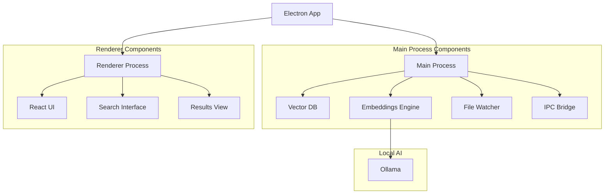
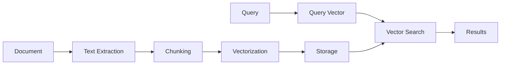
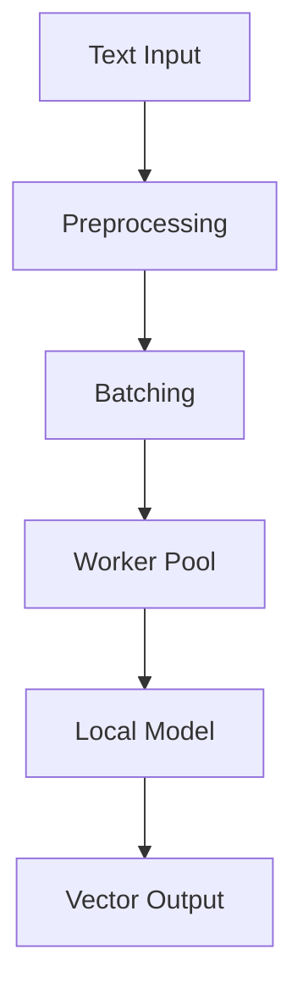
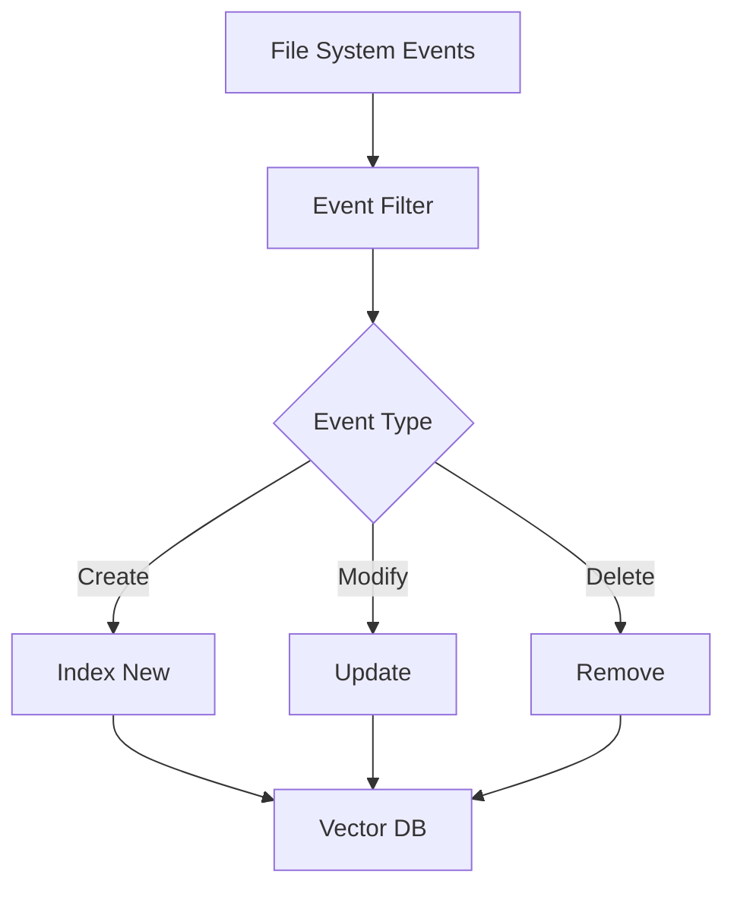
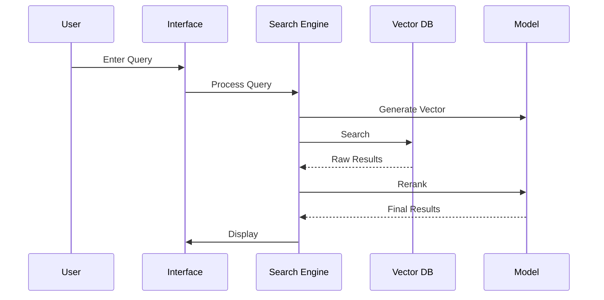
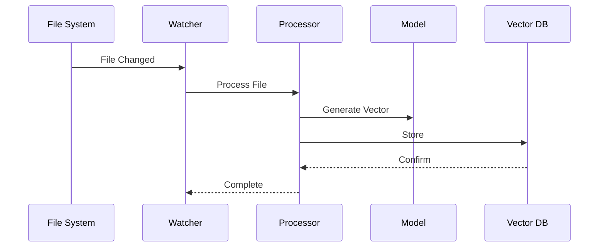

# Technical Architecture

## System Overview

alBERT-launcher uses a modern architecture built on Electron with these key components:

## Core Systems

### 1. Vector Database

Uses Weaviate Embedded for document storage and retrieval:

Key features:
- Zero-config embedded database
- Local-first architecture
- Automatic schema management
- Efficient vector storage
- Hybrid search capabilities

### 2. Embeddings Engine

Text vectorization system:

Features:
- Local model inference
- Parallel processing
- Smart batching
- Memory management
- Automatic cleanup

### 3. File System Integration

Monitors and indexes the file system:

Features:
- Real-time monitoring
- Incremental updates
- Change detection
- Automatic cleanup

## Data Flow

### Search Flow

### Indexing Flow

## Performance Optimizations

### 1. Search Performance

- Vector quantization
- Result caching
- Parallel processing
- Smart batching
- Hybrid search

### 2. Memory Management

- Worker pool reuse
- Batch processing
- Automatic cleanup
- Resource monitoring
- Memory limits

### 3. Storage Efficiency

- Incremental updates
- Change detection
- Smart caching
- Compression
- Deduplication

## Privacy Features

### 1. Local Processing

All core operations run locally:
- Vector database
- Model inference
- File indexing
- Search processing

### 2. Data Control

- No cloud dependencies
- No external APIs
- Local file access only
- No telemetry

### 3. Security

- File hashing
- Access control
- Sandboxed execution
- Secure IPC
